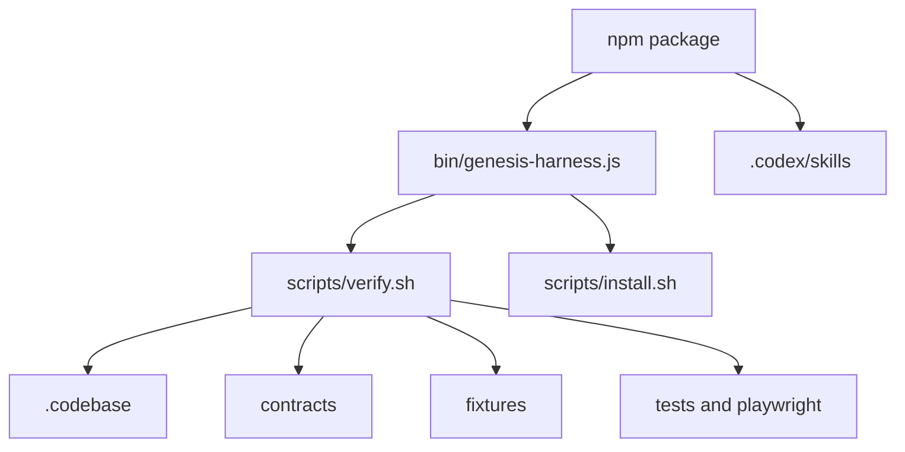

# Dependency Graph

```mermaid
flowchart TD
  npm["npm package"] --> cli["bin/genesis-harness.js"]
  npm --> skills[".codex/skills"]
  cli --> verify["scripts/verify.sh"]
  cli --> install["scripts/install.sh"]
  verify --> memory[".codebase"]
  verify --> contracts["contracts"]
  verify --> fixtures["fixtures"]
  verify --> tests["tests and playwright"]
```

