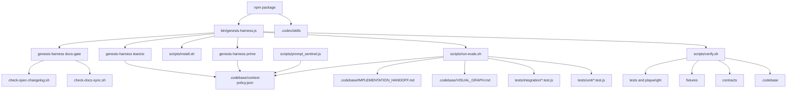

# Dependency Graph

```mermaid
flowchart TD
  npm["npm package"] --> cli["bin/genesis-harness.js"]
  npm --> skills[".codex/skills"]
  cli --> verify["scripts/verify.sh"]
  cli --> evals["scripts/run-evals.sh"]
  cli --> install["scripts/install.sh"]
  cli --> docsgate["genesis-harness docs-gate"]
  cli --> leanctx["genesis-harness leanctx"]
  cli --> prime["genesis-harness prime"]
  leanctx --> policy[".codebase/context-policy.json"]
  prime --> policy
  sentinel["scripts/prompt_sentinel.js"] --> policy
  docsgate --> docsync["check-docs-sync.sh"]
  docsgate --> specsync["check-spec-changelog.sh"]
  verify --> memory[".codebase"]
  verify --> contracts["contracts"]
  verify --> fixtures["fixtures"]
  verify --> tests["tests and playwright"]
  evals --> unit["tests/unit/*.test.js"]
  evals --> integration["tests/integration/*.test.js"]
  evals --> visual[".codebase/VISUAL_GRAPH.md"]
  evals --> handoff[".codebase/IMPLEMENTATION_HANDOFF.md"]
  evals --> policy
```
