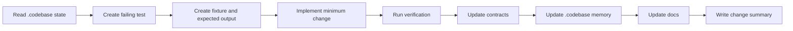

# Pipeline Flow

```mermaid
flowchart LR
  state["Read .codebase state"] --> test["Create failing test"]
  test --> fixture["Create fixture and expected output"]
  fixture --> impl["Implement minimum change"]
  impl --> verify["Run verification"]
  verify --> contracts["Update contracts"]
  contracts --> memory["Update .codebase memory"]
  memory --> docs["Update docs"]
  docs --> summary["Write change summary"]
```

