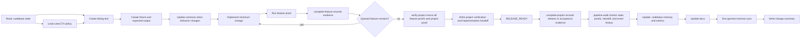

# Pipeline Flow

```mermaid
flowchart LR
  state["Read .codebase state"] --> test["Create failing test"]
  state --> leanctx["Load LeanCTX policy"]
  leanctx --> test
  test --> fixture["Create fixture and expected output"]
  fixture --> contracts["Update contracts when behavior changes"]
  contracts --> impl["Implement minimum change"]
  impl --> featureVerify["Run feature proof"]
  featureVerify --> featureComplete["complete-feature records evidence"]
  featureComplete --> queued{"Queued feature remains?"}
  queued -->|yes| impl
  queued -->|no| projectVerify["verify-project reruns all feature proofs and project proof"]
  projectVerify --> handoff["Write project verification and implementation handoff"]
  handoff --> releaseReady["RELEASE_READY"]
  releaseReady --> projectComplete["complete-project records release or acceptance evidence"]
  projectComplete --> audit["pipeline-audit checks state, proofs, handoff, and event history"]
  audit --> memory["Update .codebase memory and metrics"]
  memory --> docs["Update docs"]
  docs --> sync["Run genesis-harness sync"]
  sync --> summary["Write change summary"]
```
