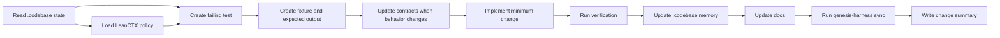

# Pipeline Flow

```mermaid
flowchart LR
  state["Read .codebase state"] --> test["Create failing test"]
  state --> leanctx["Load LeanCTX policy"]
  leanctx --> test
  test --> fixture["Create fixture and expected output"]
  fixture --> contracts["Update contracts when behavior changes"]
  contracts --> impl["Implement minimum change"]
  impl --> verify["Run verification"]
  verify --> memory["Update .codebase memory"]
  memory --> docs["Update docs"]
  docs --> sync["Run genesis-harness sync"]
  sync --> summary["Write change summary"]
```
