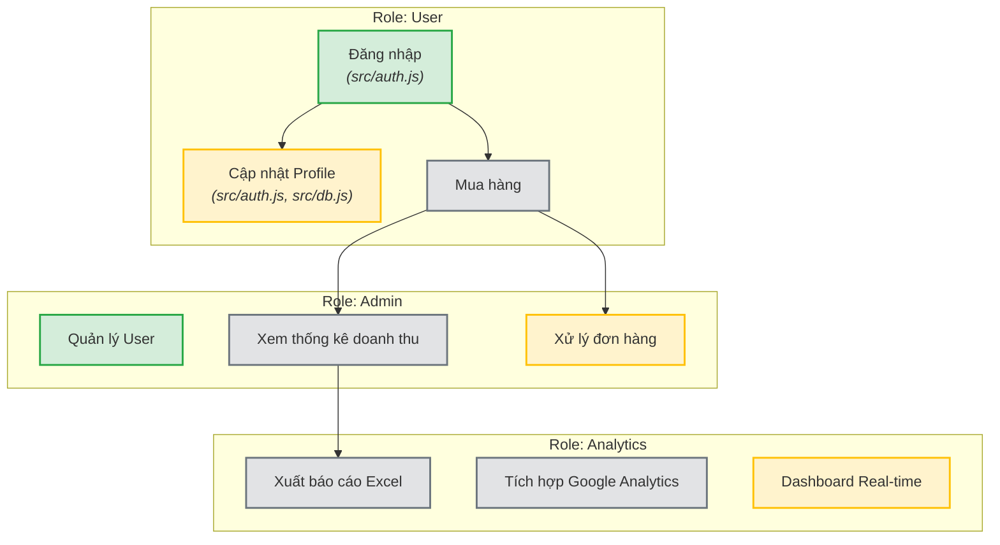

# Visual Project Graph

## Code Architecture (Dependency Graph)

```mermaid
graph TD
  "tests/unit/contract_integrity_gate.test.js" --> "assert"
  "tests/unit/contract_integrity_gate.test.js" --> "fs"
  "tests/unit/contract_integrity_gate.test.js" --> "path"
  "tests/unit/contract_integrity_gate.test.js" --> "child_process"
  "tests/unit/healing_telemetry.test.js" --> "assert"
  "tests/unit/healing_telemetry.test.js" --> "fs"
  "tests/unit/healing_telemetry.test.js" --> "path"
  "tests/unit/healing_telemetry.test.js" --> "child_process"
  "tests/unit/prompt_sentinel.test.js" --> "assert"
  "tests/unit/prompt_sentinel.test.js" --> "fs"
  "tests/unit/prompt_sentinel.test.js" --> "path"
  "tests/unit/prompt_sentinel.test.js" --> "child_process"
  "tests/unit/spec_visual_sync.test.js" --> "assert"
  "tests/unit/spec_visual_sync.test.js" --> "fs"
  "tests/unit/spec_visual_sync.test.js" --> "path"
  "tests/unit/spec_visual_sync.test.js" --> "child_process"
  "tests/unit/test_generator.test.js" --> "assert"
  "tests/unit/test_generator.test.js" --> "fs"
  "tests/unit/test_generator.test.js" --> "path"
  "tests/unit/test_generator.test.js" --> "child_process"
  "bin/genesis-harness.js" --> "fs"
  "bin/genesis-harness.js" --> "path"
  "bin/genesis-harness.js" --> "child_process"
  "bin/genesis-harness.js" --> "@babel/parser"
  "bin/genesis-harness.js" --> "@babel/traverse"
  "bin/genesis-harness.js" --> "child_process"
```

## Project Roadmap & Features



