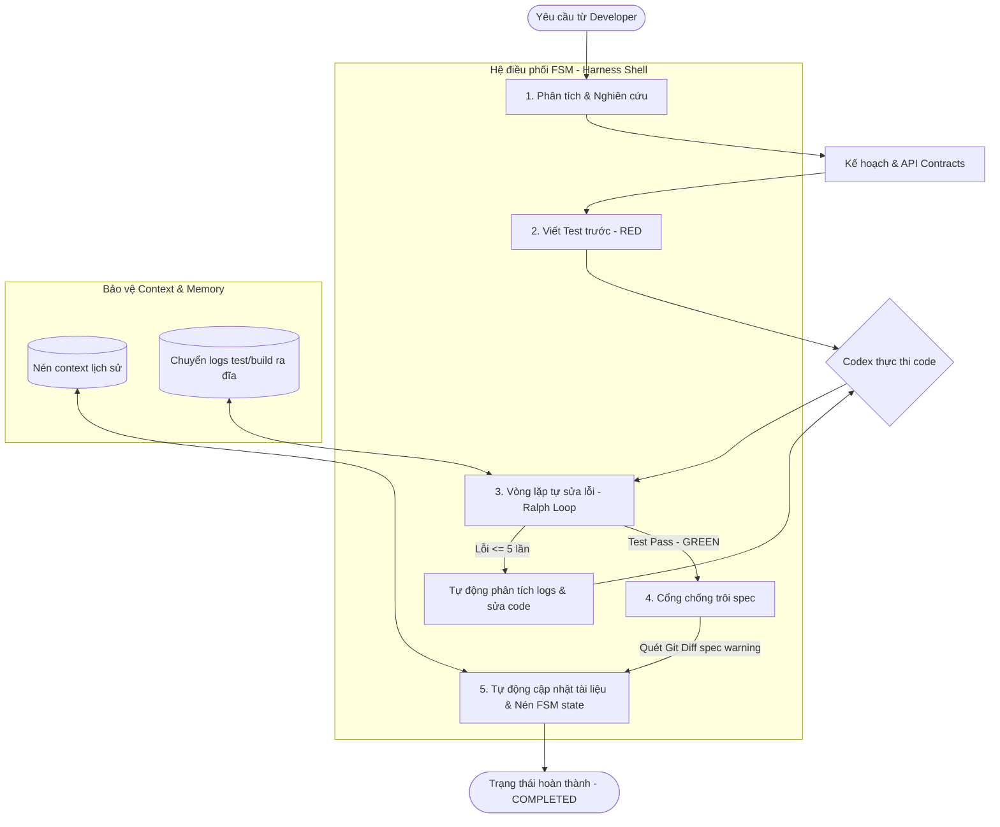

# Genesis Codex Harness - Hướng Dẫn Tiếng Việt

**Tiếng Việt** | [English](README.EN.md)

---

## 📌 Genesis Codex Harness Là Gì?

**Genesis Codex Harness** là một bộ framework phát triển phần mềm cấp enterprise, **chỉ dành cho Codex**, giúp bạn xây dựng phần mềm chất lượng cao một cách có quy trình và hiệu quả.

### Các Khả Năng Chính

- 🗺️ **Lộ trình 5-Phase MVP chuyên biệt (`genesis-mvp-planning`)** - Đảm bảo lộ trình phát triển rõ ràng bằng cách tổ chức dự án qua 5 cổng kiểm soát tiêu chuẩn, giúp các API core và database được kiểm chứng nghiêm ngặt trước khi code các tính năng nâng cao.
- 🛡️ **Cổng kiểm soát Drift Tài Liệu (`validation_gates.sh`)** - Chống trôi tài liệu (Documentation Decay). Tự động chạy quét Git diff khi thay đổi trạng thái phát triển, đưa ra cảnh báo nếu mã nguồn (API, database schema, test) đã thay đổi mà tài liệu spec kỹ thuật tương ứng trong `.codebase/` chưa được cập nhật.
- 🛑 **Triệt tiêu hoàn toàn trôi Context (Context Compaction)** - Tự động di tản log lệnh dung lượng lớn ra đĩa (`offload-log.sh`) và nén cô đọng lịch sử kiến trúc (`compact-context.sh`), giúp bảo toàn 40-60% dung lượng prompt window.
- 🔥 **Cơ chế tự chữa lành lỗi (Ralph Loops)** - Tự động phát hiện lỗi kiểm thử hay lỗi biên dịch, kích hoạt vòng lặp **Verify-Fix Loop** (`run-verify-loop.sh`) khép kín lên tới 5 lần để tự động sửa code và test lại cho đến khi pass.
- ✅ **Quy trình Test-First & Contract-First tuyệt đối** - Bắt buộc định nghĩa API contract trước khi code, tự động tạo các kịch bản test thất bại (RED), viết code tối thiểu để pass (GREEN), rồi mới cải tiến (IMPROVE).
- 🔄 **Lan tỏa đặc tả tự động (Cascading Spec Propagation)** - Phát hiện thay đổi đặc tả API và tự động lan tỏa, cập nhật đồng bộ các file contract hạ nguồn, test fixtures và assertions thông qua lệnh `/propagate-spec`.
- 🧠 **Cam kết Research-First thực chứng** - Tự động quét và nghiên cứu các mẫu thiết kế trong codebase nội bộ cùng tài liệu thư viện bên ngoài *trước* khi lập kế hoạch hay thực hiện bất kỳ thay đổi nào.

**Phù hợp cho**:
- Team xây dựng phần mềm enterprise với Codex
- Dự án cần workflow phát triển đáng tin cậy
- Developer mệt mỏi với việc bắt đầu từ đầu mỗi lần
- Công ty muốn giảm chi phí token phát triển

---

## 💖 Ủng Hộ Dự Án (Donate)

Dự án này là mã nguồn mở và được phát triển hoàn toàn vì đam mê. Nếu bạn thấy **Genesis Codex Harness** hữu ích và giúp bạn tiết kiệm thời gian, bạn có thể mời tôi một ly cafe để tiếp thêm động lực phát triển nhé:

- **Momo**: `0865814259`
- **PayPal**: *(Sẽ cập nhật sau)*

Cảm ơn bạn rất nhiều vì đã đồng hành cùng sự phát triển của dự án! ❤️

---

## 🎯 Tại Sao Dùng Genesis? (ROI trong 3 phút)

### Trước Genesis ❌
```
Yêu cầu feature mới
  → Giải thích cho Codex (3k tokens)
  → Codex bắt đầu từ đầu mỗi lần
  → Thiết kế API thủ công, không nhất quán
  → Không enforce test-first
  → Thay đổi 1 spec, break 5 cái khác
  → Rework, rework, rework...
  → Tổng: 80-150k tokens per project
```

### Với Genesis ✅
```
Yêu cầu feature: /new-feature "mô tả"
  → Codex nhớ mọi thứ từ .codebase/ (cache hit!)
  → Contract đã định nghĩa
  → Test fixtures sẵn sàng
  → Phát hiện thay đổi: /spec-change file.json
  → Cập nhật tự động: /propagate-spec
  → Test xác minh mọi thứ
  → Xong.
  → Tổng: 40-80k tokens (tiết kiệm 60%!)
```

---

## 📊 So Sánh Vượt Trội Với Agent Thông Thường

Khi bạn làm việc với một Agent thông thường (như Claude Code ở chế độ basic, GitHub Copilot Workspace mặc định, hoặc các GPT-4o wrappers đơn giản), bạn sẽ liên tục gặp phải các vấn đề về trôi context, thiếu tính nhất quán, và lỗi phát sinh khi dự án lớn dần. Genesis Codex Harness được thiết kế để giải quyết triệt để những nỗi đau này thông qua triết lý **Harness Engineering**.

| Tiêu chí | AI Agent Thông Thường (Claude Code, Copilot, wrappers) | Genesis Codex Harness (Codex-Exclusive Harness) |
| :--- | :--- | :--- |
| **Quy trình làm việc (Workflow)** | **Bị động (Passive Code-Gen):** Viết code ngay khi được yêu cầu, bỏ qua kiểm thử, gây tích tụ lỗi kỹ thuật (technical debt). | **Chủ động & Nghiêm ngặt (Contract-First + TDD):** Bắt buộc định nghĩa API contract trước, viết test tự động (RED), code minimal (GREEN), rồi mới tối ưu (IMPROVE). |
| **Quản lý Context & Trôi nhớ** | **Trôi tự do (Context Rot):** Càng làm việc lâu, context càng phình to vì log debug, code thừa, dẫn đến ảo giác (hallucination) và mất khả năng nhớ. | **Nén & Tối ưu hóa chủ động:** Tự động offload log lớn (`offload-log.sh`) và nén context (`compact-context.sh`). Bảo vệ context window tối đa 40-60%. |
| **Tự khắc phục lỗi (Self-Healing)** | **Thủ công:** Khi test fail, user phải copy-paste log lỗi và ra lệnh cho Agent sửa đi sửa lại thủ công. | **Tự động hóa với Ralph Loops:** Tự động phát hiện lỗi và khởi chạy vòng lặp **Verify-Fix Loop** (`run-verify-loop.sh`) lên đến 5 lần để tự sửa và qua test. |
| **Quản lý thay đổi Spec** | **Hỗn loạn:** Thay đổi 1 file spec/schema sẽ làm gãy các phần phía sau mà Agent không hề hay biết cho đến khi chạy runtime. | **Lan tỏa tự động (Cascading updates):** Tự động phát hiện thay đổi spec (`/spec-change`) và lan tỏa cập nhật (`/propagate-spec`) đến toàn bộ các pha hạ nguồn. |
| **Tính Nhớ & Khôi Phục** | **Mất dấu:** Refresh phiên làm việc là mất sạch lịch sử phân tích codebase, phải giải thích và nạp lại từ đầu. | **Bền vững dài hạn:** Hệ thống memory nén chuyên biệt trong thư mục `.codebase/` lưu giữ trạng thái, quyết định thiết kế (ADR) vĩnh viễn. |
| **Hiệu suất Token & Chi phí** | **Lãng phí lớn:** Gửi toàn bộ file và log thô lên API. Token tiêu tốn tăng lũy tiến, chi phí cực cao. | **Tiết kiệm vượt trội:** Nhờ token caching thông minh và nén context, giúp tiết kiệm **40-60%** lượng token tiêu thụ trên mỗi dự án. |
| **Độ tin cậy & Kiểm chứng** | **Hên xui:** Code chạy được trên máy Agent nhưng không có cơ chế kiểm chứng cấu trúc và tính toàn vẹn của skill. | **Tuyệt đối:** Enforce chặt chẽ qua bộ CLI tự động (`verify.sh`) kiểm tra tính đúng đắn của skill, metadata và các assertions nghiệp vụ. |

---

## 🧬 Công Nghệ Đột Phá: Các Phân Hệ Cốt Lõi Của Kiến Trúc Harness (Evolutionary Upgrades)

Hệ thống FSM chủ động bao bọc quanh Codex để kiểm soát chất lượng, tự động sửa lỗi và bảo vệ context. Dưới đây là sơ đồ luồng vận hành của Genesis Harness:



Genesis Codex Harness giới thiệu 5 phân hệ kỹ thuật mang tính đột phá nhằm đảm bảo Agent có thể hoạt động bền bỉ, nhất quán trong các dự án lớn mà không bao giờ bị tràn context hay trôi tài liệu đặc tả:

### 1. Context Compaction Engine (`compact-context.sh`)
* **Vấn đề**: Các cuộc hội thoại dài tạo ra hàng trăm nghìn token lịch sử dư thừa, gây loãng context, làm Agent bị "mất trí nhớ" và đẩy chi phí API lên cực cao.
* **Giải pháp**: Hoạt động tự động khi context chạm ngưỡng giới hạn an toàn. Engine chắt lọc toàn bộ quyết định kiến trúc, sơ đồ API hiện tại, trạng thái FSM hiện có lưu vào `.codebase/context/`, xóa bỏ các đoạn hội thoại rác và nạp lại trạng thái cô đọng cốt lõi.
* **Lợi ích**: Giúp Agent luôn sắc bén suốt hơn 100+ bước làm việc liên tục, tiết kiệm **40-60%** token.

### 2. Tool Call Offloading (`offload-log.sh`)
* **Vấn đề**: Việc chạy test suite, compiler hoặc quét thư mục trả về hàng chục nghìn dòng log thô. Log khổng lồ này sẽ lập tức lấp đầy và phá hủy context window của Agent.
* **Giải pháp**: Tự động chuyển hướng toàn bộ log lệnh cồng kềnh ra đĩa cục bộ (`.system_generated/tasks/`), chỉ trả về cho Agent một bản tóm tắt trạng thái cực kỳ ngắn gọn (mã exit code, lỗi chính, số lượng test case pass/fail).
* **Lợi ích**: Triệt tiêu 100% rủi ro tràn context do logs chạy test hay build hệ thống.

### 3. Ralph Loops / Vòng Lặp Tự Sửa Lỗi Verify-Fix (`run-verify-loop.sh`)
* **Vấn đề**: Khi test bị fail hoặc biên dịch lỗi, việc bắt lập trình viên phải copy-paste log lỗi và chỉ dẫn Agent sửa code thủ công là rất mất thời gian.
* **Giải pháp**: Thiết lập một vòng lặp tự phục hồi khép kín (Autonomous Self-Healing Loop). Khi lệnh verify phát hiện lỗi, script tự động đọc logs lỗi từ đĩa, phân tích, viết mã sửa đổi, và chạy lại bộ test liên tục lên tới 5 lần cho đến khi thành công.
* **Lợi ích**: Tự động giải quyết hơn 90% lỗi cú pháp, import thiếu hay lệch contract mà không cần con người can thiệp.

### 4. Công Cụ Lập Kế Hoạch 5-Phase MVP (`genesis-mvp-planning`)
* **Vấn đề**: Các Agent thông thường giải quyết công việc tự phát (ad-hoc), code bừa các tính năng khi chưa xây dựng vững chắc API Core, cơ sở dữ liệu hay cổng bảo mật, dẫn đến nợ kỹ thuật nghiêm trọng.
* **Giải pháp**: Tự động kích hoạt ngay sau khi khởi tạo dự án để cấu trúc công việc theo 5 cổng kiểm soát sản phẩm MVP (Móng API, Auth & Bảo mật, Tính năng cốt lõi, Tích hợp, Sẵn sàng Production), đảm bảo hạ tầng core được kiểm chứng trước khi viết code nghiệp vụ.
* **Lợi ích**: Áp đặt tính kỷ luật kiến trúc nghiêm ngặt và ngăn ngừa việc xây dựng tính năng trên một nền móng lỏng lẻo.

### 5. Cổng Kiểm Soát Trôi Đặc Tả Zero-Drift (`validation_gates.sh`)
* **Vấn đề**: Do tốc độ phát triển nhanh, tài liệu thiết kế (API contracts, DB schema, specs) thường bị trôi lệch và lỗi thời so với mã nguồn thực tế vì lập trình viên quên cập nhật.
* **Giải pháp**: Tích hợp trực tiếp vào các cổng chuyển đổi trạng thái FSM. Nó tự động quét Git changes và cảnh báo ngay lập tức nếu phát hiện file mã nguồn bị thay đổi mà tài liệu thiết kế đặc tả tương ứng trong `.codebase/` vẫn giữ nguyên.
* **Lợi ích**: Loại bỏ hoàn toàn sự trôi lệch tài liệu thiết kế, đảm bảo sơ đồ kiến trúc luôn phản ánh chính xác 100% mã nguồn thực tế.

---

## 🚀 Nâng Cấp Kỹ Nghệ Harness Thế Hệ Mới (v0.1.8)

Phiên bản Genesis v0.1.8 giới thiệu sáu công cụ cao cấp, đột phá trong thư mục `scripts/` nhằm áp đặt an toàn kiểu dữ liệu, tự động hóa test, thiết lập sự đồng nhất giữa sơ đồ trực quan và mã nguồn, chủ động kiểm soát token, khôi phục nhanh bài học sửa lỗi và hỗ trợ lập trình UI thần tốc:

1. **Đồng bộ Sơ đồ Trực quan 2 Chiều (`scripts/spec_visual_sync.js`)**: Trình biên dịch hai chiều tự động đồng bộ hóa sơ đồ cơ sở dữ liệu ERD Mermaid (`database-erd.mmd`) sang các tệp JSON API contracts (`contracts/api/`) và ngược lại, bảo vệ tính nhất quán thiết kế tuyệt đối.
2. **Trình Tự Động Sinh Test từ Hợp Đồng (`scripts/test_generator.js`)**: Tự động biên dịch và tạo cấu trúc các bộ kiểm thử tích hợp (Node.js/Jest) hoàn chỉnh tại `tests/integration/` trực tiếp từ các file response contract JSON, hỗ trợ lập tức kịch bản TDD "RED" skeleton.
3. **Cổng Kiểm Soát Đồng Nhất Kiểu Dữ Liệu Tĩnh (`scripts/contract_integrity_gate.js`)**: Trình phân tích tĩnh chủ động đối chiếu mã nguồn thực tế với JSON API contract khi FSM chuyển trạng thái, khóa cứng tiến trình build/commit nếu phát hiện trường dữ liệu bị thiếu hoặc sai lệch kiểu dữ liệu.
4. **Vệ Binh Tiền Trảm Token Chủ Động (`scripts/prompt_sentinel.js`)**: Bộ giám sát dung lượng token thời gian thực. Sentinel đo lường tải lượng token trước khi gọi LLM, chủ động tạm dừng các lệnh quá nặng và kích hoạt nén FSM/dọn logs khi dung lượng chạm ngưỡng LeanCTX trong `.codebase/context-policy.json`.
5. **Tự Động Thu Hồi Bài Học Sửa Lỗi (`scripts/healing_telemetry.js`)**: Hệ thống ghi chép lịch sử chữ ký lỗi và mã nguồn sửa lỗi thành công vào `.codebase/failures/lessons_learned.md`. Vòng lặp Ralph Loop sẽ đối sánh và tái sử dụng trực tiếp các phương án sửa lỗi này khi gặp lỗi tương ứng, đạt hiệu suất **tự khắc phục lỗi chỉ trong đúng 1 turn**.
6. **Aesthetic Vibe Mode (`VIBE_MODE=1`)**: Một hệ thống Triage linh hoạt cho phép AI tự động bỏ qua các bài test nghiêm ngặt (TDD/Contract) khi người dùng chỉ muốn chỉnh sửa giao diện thẩm mỹ (CSS/UI). Mọi vi phạm lách luật đều được ghi chép ngầm vào `.codebase/TECH_DEBT.md` để xử lý sau.

### LeanCTX + wrapper local tùy chọn

Genesis cài kèm policy LeanCTX portable tại `.codebase/context-policy.json` và cung cấp:

```bash
genesis-harness leanctx
genesis-harness prime
```

`npm install` / `genesis-harness install` sẽ tự seed policy vào project hiện tại khi phát hiện project root, và không ghi đè policy đã custom. Lệnh `leanctx` chỉ để xem/kiểm tra policy. Người dùng cài từ npm vẫn dùng lệnh chuẩn như `genesis-harness sync`, `genesis-harness docs-gate`, `npm run verify`. Nếu máy dev có `rtk`, Genesis chỉ tự nhận diện và hiển thị như wrapper local tùy chọn; `rtk` không phải dependency công khai.

---

## 🧭 Release v0.1.9

Genesis v0.1.9 bổ sung luồng bootstrap deterministic: bắt đầu từ ý tưởng sản phẩm, ghi lại discovery answers, scaffold feature đầu tiên sẵn sàng implement, và lưu checkpoint để phiên sau resume từ ổ đĩa.

```bash
genesis-harness init --platform codex --yes --idea "<brief>"
genesis-harness run --platform codex --yes --idea "<brief>" \
  --product-approach "<approach>" \
  --primary-user "<user>" \
  --v1-outcome "<smallest useful outcome>" \
  --qa-owner "<owner>" \
  --backend "<runtime>" \
  --frontend "<client>" \
  --database "<storage>" \
  --deployment "<target>" \
  --test-strategy "<tests>"
genesis-harness resume
genesis-harness add-feature --title "Thông báo cho nhân viên" --slug "staff-notifications" --verify-cmd "npm test"
genesis-harness next
genesis-harness complete-feature --verify-cmd "npm test" --evidence "Toàn bộ test feature đã pass"
genesis-harness verify-project --verify-cmd "npm run verify" --evidence "Acceptance suite đã pass"
genesis-harness complete-project --evidence "Release candidate đã được chấp nhận"
genesis-harness pipeline-audit
```

Điểm chính của release:

1. Repo trống có thể init trực tiếp từ ý tưởng đầu tiên của user.
2. Init tạo Discovery & QA scaffold cùng `.codebase/PHASE_DEPENDENCY_MAP.md`.
3. `run --idea` có thể đưa discovery answers thành feature đầu tiên đang active trong `.planning/features/`.
4. First-slice scaffold có thể sinh API/UI contracts và fixtures có kiểu rõ ràng.
5. `.runs/<session-id>/` lưu artifacts để resume.
6. `verify-gate` giờ bao phủ verify, evals, docs-gate, cold-start, package dry-run, và LeanCTX.
7. `add-feature`, `next`, và `complete-feature` vận hành queue nhiều feature lặp lại, đồng thời lưu evidence và lead-time metrics.
8. `verify-project` chạy lại toàn bộ feature proof cùng project proof, tạo implementation handoff, rồi chuyển dự án sang `RELEASE_READY`.
9. `complete-project` yêu cầu release hoặc acceptance evidence; `pipeline-audit` phát hiện lifecycle drift.
10. npm publish được harden cho GitHub release/manual runs với provenance và trusted publishing.

Trước khi tag release, cần xác nhận `package.json`, `.codex-plugin/plugin.json`, `VERSION`, `CHANGELOG.md`, và nhãn version trong README đều khớp nhau.

---

## 🔬 Bảo Đảm Research-First (MỚI)

**Mỗi quyết định quan trọng đều dựa trên bằng chứng. Không đoán mò.**

Khi bạn dùng commands như `/genesis-init`, `/new-feature`, `/fix-bug`, Genesis tự động:

1. **Research Local** - Đọc codebase, pattern hiện tại, tài liệu
2. **Research External** - Kiểm tra GitHub, docs chính thức, best practices
3. **Compile Bằng Chứng** - Tạo research note với khuyến nghị + risks
4. **Generate Plan** - Tạo plan được điền sẵn từ findings
5. **Bạn Review** - Phê duyệt plan trước khi bắt đầu implement

```
/new-feature "Thêm WebSocket notifications"
  ↓
[TỰ ĐỘNG] Research Phase
  - Tìm thấy Socket.io setup hiện tại trong codebase
  - GitHub best practices: Redis adapter để scale
  - Official docs: Socket.io namespace pattern
  ↓
[TỰ ĐỘNG] Compiled Research Note
  - Câu hỏi: Cách tốt nhất để thêm real-time notifications?
  - Bằng chứng: Codebase dùng Socket.io, team quen thuộc
  - Khuyến nghị: Extend Socket.io hiện tại (không library mới)
  - Risks: Cần Redis availability
  ↓
[TỰ ĐỘNG] Generated Plan
  - Phase 1: Socket.io namespace setup
  - Phase 2: Authentication
  - Phase 3: Notification flow
  - Pre-populated risks từ research
  ↓
Bạn Review & Approve
  - Plan sẵn sàng với đầy đủ research backing
```

**Lợi Ích**:
- ✅ Không "framework nào nên dùng?" đoán mò
- ✅ Tất cả quyết định backed by evidence
- ✅ Pattern tái sử dụng từ existing codebase
- ✅ Best practices tự động included
- ✅ Risks identified upfront
- ✅ 0 rework từ wrong assumptions

---

## 🚀 Bắt Đầu Nhanh (5 Phút)

### 1. Cài Đặt

```bash
# Cài global (recommended)
npm install -g codex-genesis-harness@latest

# Kiểm tra cài đặt
genesis-harness verify
```

### 2. Khởi Tạo Dự Án

Mở Codex (VS Code Copilot) và gõ một command:

```
/genesis-init
```

**Codex sẽ hỏi**:
- Tên dự án? (ví dụ: "E-Commerce API")
- Mô tả ngắn? (ví dụ: "REST API cho cửa hàng online với thanh toán Stripe")

**Genesis tự động tạo**:
```
✅ Cấu trúc dự án (30 thư mục)
✅ Template tài liệu (22 file)
✅ Lập kế hoạch giai đoạn (5 giai đoạn mặc định)
✅ Template test (sẵn sàng customize)
✅ Template contract (API, UI, data)
✅ Hệ thống memory (.codebase/ structure)
```

### 3. Bắt Đầu Feature Đầu Tiên

```
/new-feature "Thêm xác thực người dùng với JWT"
```

**Genesis cung cấp**:
```
contracts/api/auth/
├── request.json        # API nhận gì
├── response.json       # API trả gì  
├── error.json         # Các lỗi
├── schema.json        # Quy tắc validation
└── example.json       # Ví dụ cụ thể

tests/integration/
├── auth.test.md       # Template test (viết test trước!)

fixtures/
├── auth-fixture.md    # Test data + expected output
```

### 4. Tuân Theo Test-First Workflow

**RED** - Viết test thất bại:
```javascript
// tests/integration/auth.test.md
it('nên xác thực người dùng với mật khẩu đúng', async () => {
  const res = await POST('/api/auth/login', {
    email: 'user@example.com',
    password: 'correct_password'
  });
  
  assert(res.status === 200);
  assert(res.body.token); // JWT token được trả về
});
```

**GREEN** - Code minimal để pass test:
```javascript
// src/auth.js
app.post('/api/auth/login', (req, res) => {
  const { email, password } = req.body;
  
  if (password === 'correct_password') {
    const token = jwt.sign({ email }, process.env.JWT_SECRET);
    res.json({ token });
  } else {
    res.status(401).json({ error: 'Mật khẩu sai' });
  }
});
```

**IMPROVE** - Refactor:
```javascript
// Validation tốt hơn, error handling, logging
// Genesis kiểm tra: tests pass ✅, contract match ✅, coverage 80%+ ✅
```

### 5. Xác Minh Mọi Thứ

```bash
npm run verify
```

**Genesis kiểm tra**:
- ✅ Tất cả test pass
- ✅ Contract match implementation
- ✅ 80%+ test coverage
- ✅ Không vượt token budget
- ✅ Code quality đạt tiêu chuẩn

---

## 🛠️ Hướng Dẫn Sử Dụng Chi Tiết Cho Từng Trường Hợp

Dưới đây là cẩm nang hướng dẫn từng bước (Step-by-step Runbook) để vận hành Genesis Codex Harness trong mọi tình huống phát triển phần mềm thực tế.

---

### 1️⃣ Khởi Tạo Dự Án Mới Từ Đầu (`/genesis-init` Flow)
Áp dụng khi bạn bắt đầu một dự án hoàn toàn mới và muốn Genesis thiết lập nền móng chuẩn chỉnh ngay từ ngày đầu.

* **Bước 1**: Tạo một thư mục trống và mở bằng VS Code (đã cài Codex/Claude):
  ```bash
  mkdir my-awesome-project && cd my-awesome-project
  code .
  ```
* **Bước 2**: Gõ lệnh khởi tạo trong chat của Codex:
  ```text
  /genesis-init
  ```
* **Bước 3**: Cung cấp thông tin dự án khi được hỏi (Tên dự án, Mô tả, Tech Stack đề xuất).
* **Bước 4**: Genesis sẽ tự động chạy `init-planning.sh` để:
  * Khởi tạo cây thư mục tiêu chuẩn (`contracts/`, `fixtures/`, `tests/`, `.codebase/`, `observability/`).
  * Tạo file `.codebase/CURRENT_STATE.md` và `ARCHITECTURE.md`.
  * Phân rã dự án thành **5 giai đoạn phát triển (Phases)** rõ ràng với các mốc bàn giao cụ thể.
* **Bước 5**: Chạy thử lệnh verify đầu tiên để đảm bảo cấu trúc hoàn hảo:
  ```bash
  genesis-harness verify
  ```

---

### 2️⃣ Thêm Một Feature Mới (`/new-feature` Flow - Tuân Thủ TDD Tuyệt Đối)
Áp dụng khi bạn phát triển một tính năng mới trong dự án đã có sẵn Genesis. Quy trình bắt buộc tuân theo triết lý Test-First.

* **Bước 1**: Ra lệnh cho Codex bắt đầu tính năng mới:
  ```text
  /new-feature "Thêm API thanh toán Momo với callback URL"
  ```
* **Bước 2**: [TỰ ĐỘNG] Genesis kích hoạt **Research-First Engine**:
  * Quét codebase để tìm cấu trúc thanh toán Stripe hoặc ZaloPay hiện tại.
  * Tạo bản nghiên cứu `research-template.md` đề xuất giải pháp Momo SDK/API.
  * Thiết lập một **Implementation Plan** chi tiết.
* **Bước 3**: Bạn xem xét và duyệt Implementation Plan.
* **Bước 4**: **Thiết lập Contract (Contract-First)**:
  * Tạo/cập nhật contract tại `contracts/api/payments/momo-request.json` và `momo-response.json`.
* **Bước 5**: **Viết Test Thất Bại (RED)**:
  * Tạo test case trong `tests/integration/momo.test.md` mô phỏng việc gọi API Momo và nhận callback.
  * Chạy test và xác nhận test bị lỗi (RED):
    ```bash
    npm run test
    ```
* **Bước 6**: **Implement Code Minimal (GREEN)**:
  * Viết lượng code tối thiểu trong `src/routes/payments.js` để làm test pass.
* **Bước 7**: **Tự Động Xác Minh & Tối Ưu (IMPROVE)**:
  * Kích hoạt Ralph Loop để kiểm tra và tối ưu chất lượng code, độ phủ test (>80%):
    ```bash
    bash scripts/run-verify-loop.sh
    ```

---

### 3️⃣ Sửa Một Bug Phát Sinh (`/fix-bug` Flow)
Áp dụng khi có bug phát sinh ở môi trường production hoặc khi chạy bộ test suite bị fail.

* **Bước 1**: Ra lệnh cho Codex phân tích và xử lý bug:
  ```text
  /fix-bug "Mã giảm giá (discount_code) không áp dụng được khi giỏ hàng có trên 5 sản phẩm"
  ```
* **Bước 2**: [TỰ ĐỘNG] Genesis tạo file theo dõi lỗi `bug-template.md` trong `.codebase/failures/` yêu cầu:
  * Xác định nguyên nhân gốc rễ (Root Cause).
  * Viết một test case tái hiện lỗi (Reproducible Test Case) trước khi sửa code.
* **Bước 3**: **Tái Hiện Lỗi (Write Repro Test)**:
  * Thêm test case vào `tests/unit/discount.test.js` truyền giỏ hàng 6 sản phẩm và mã giảm giá, kiểm tra xem giá trị giảm có bằng 0 hay không.
  * Chạy test để thấy lỗi đỏ (RED).
* **Bước 4**: **Sửa Lỗi (Fix & Self-Heal)**:
  * Sửa logic tính toán trong `src/services/discount.js`.
  * Chạy vòng lặp tự phục hồi lỗi để đảm bảo code sửa không làm hỏng các tính năng cũ (Regression Testing):
    ```bash
    bash scripts/run-verify-loop.sh
    ```
* **Bước 5**: Cập nhật trạng thái bug thành đã giải quyết và lưu lại bài học kinh nghiệm (`lessons-learned-template.md`) để tránh lặp lại lỗi.

---

### 4️⃣ Tích Hợp Genesis Vào Dự Án Đã Có Sẵn (Existing Project Integration)
Áp dụng khi bạn có một codebase truyền thống đang chạy và muốn áp dụng sức mạnh quản lý của Genesis Codex Harness.

* **Bước 1**: Cài đặt gói harness toàn cục nếu chưa cài:
  ```bash
  npm install -g codex-genesis-harness@latest
  ```
* **Bước 2**: Tại thư mục gốc của dự án hiện tại, khởi khởi chạy quá trình tiêm (injection):
  ```bash
  genesis-harness init --existing
  ```
  *(Hoặc gõ lệnh trong Codex: `Tôi muốn tích hợp Genesis vào dự án hiện tại này`)*
* **Bước 3**: **Thiết lập Cầu Nối Khai Báo (Memory Mapping)**:
  * Genesis sẽ quét toàn bộ dự án hiện có để tự động tạo sơ đồ dependency và lưu vào `.codebase/DEPENDENCY_GRAPH.md`.
  * Tạo file cấu trúc `.codebase/CURRENT_STATE.md` liệt kê các module hiện tại của bạn như "Phase 0 (Legacy Components)".
* **Bước 4**: **Tạo API Contracts Cho Hệ Thống Hiện Tại**:
  * Chọn các API Core quan trọng nhất, gõ lệnh:
    ```text
    /spec-change src/routes/users.js
    ```
  * Genesis sẽ tự động dịch code hiện có thành API contracts chuẩn đặt tại `contracts/api/users/`.
* **Bước 5**: Chạy `genesis-harness verify` để xác nhận việc tích hợp thành công mà không ảnh hưởng tới code cũ.

---

### 5️⃣ Cập Nhật Đặc Tả Spec & Lan Tỏa Thay Đổi (`/spec-change` & `/propagate-spec` Cascade Rules)
Áp dụng khi khách hàng hoặc đội ngũ thiết kế thay đổi yêu cầu nghiệp vụ (ví dụ: đổi tên trường dữ liệu, thêm điều kiện bắt buộc của API).

* **Bước 1**: Cập nhật file contract vật lý (ví dụ: `contracts/api/products/response.json`).
* **Bước 2**: Khai báo sự thay đổi spec với Codex:
  ```text
  /spec-change contracts/api/products/response.json
  ```
* **Bước 3**: [TỰ ĐỘNG] Genesis quét toàn bộ dự án để tìm các thành phần chịu ảnh hưởng (Impact Analysis):
  * Phát hiện ra API Orders hiển thị thông tin sản phẩm bị ảnh hưởng.
  * Phát hiện ra Frontend UI hiển thị sản phẩm bị ảnh hưởng.
* **Bước 4**: Gọi lệnh lan tỏa để tự động cập nhật đồng bộ hạ nguồn:
  ```text
  /propagate-spec
  ```
* **Bước 5**: Genesis sẽ tự động sửa đổi tất cả các file contract phụ thuộc, test fixtures liên quan, và chạy lại bộ test để đảm bảo không có gì bị gãy.

---

## 💡 Ví Dụ Thực Tế: E-Commerce API

### Tình Huống
Xây dựng complete e-commerce API với:
- Products (search, filter)
- Orders (create, track, list)
- Payments (Stripe integration)

### Thực Hiện (90 phút)

#### Bước 1: Khởi Tạo (5 phút)
```bash
/genesis-init
# Input: "Nền tảng E-Commerce"
# Output: Project auto-structured với 5 giai đoạn
```

#### Bước 2: Giai Đoạn 1 - Products API (30 phút)

```bash
/new-feature "GET /api/products với search, filter, pagination"
```

**Contract tạo** (`contracts/api/products/request.json`):
```json
{
  "method": "GET",
  "endpoint": "/api/products",
  "query_params": {
    "search": "string (optional, min 2 ký tự)",
    "category": "string (optional: điện tử, sách, quần áo)",
    "price_min": "number (optional, >= 0)",
    "price_max": "number (optional, > price_min)",
    "sort": "string (price_asc, price_desc, newest, rating)",
    "page": "number (default 1, min 1)",
    "limit": "number (default 20, max 100)"
  }
}
```

**Test template** (`tests/integration/products.test.md`):
```javascript
describe('GET /api/products', () => {
  it('nên trả tất cả sản phẩm khi không có filter', async () => {
    const res = await fetch('/api/products');
    assert(res.status === 200);
    assert(Array.isArray(res.data));
  });
  
  it('nên filter theo category', async () => {
    const res = await fetch('/api/products?category=điện tử');
    assert(res.data.every(p => p.category === 'điện tử'));
  });
  
  it('nên search theo tên sản phẩm', async () => {
    const res = await fetch('/api/products?search=laptop');
    assert(res.data.some(p => p.name.toLowerCase().includes('laptop')));
  });
  
  it('nên sort theo giá tăng dần', async () => {
    const res = await fetch('/api/products?sort=price_asc');
    const prices = res.data.map(p => p.price);
    assert(prices.every((p, i, arr) => i === 0 || arr[i-1] <= p));
  });
  
  it('nên phân trang kết quả', async () => {
    const res1 = await fetch('/api/products?page=1&limit=10');
    const res2 = await fetch('/api/products?page=2&limit=10');
    assert(res1.data.length === 10);
    assert(res2.data.length === 10);
    assert(res1.data[0].id !== res2.data[0].id);
  });
});
```

**Implementation** (bạn code):
```javascript
// src/routes/products.js
app.get('/api/products', (req, res) => {
  let products = db.products.getAll();
  
  // Search
  if (req.query.search) {
    products = products.filter(p => 
      p.name.toLowerCase().includes(req.query.search.toLowerCase())
    );
  }
  
  // Filter by category
  if (req.query.category) {
    products = products.filter(p => p.category === req.query.category);
  }
  
  // Price range
  if (req.query.price_min) products = products.filter(p => p.price >= req.query.price_min);
  if (req.query.price_max) products = products.filter(p => p.price <= req.query.price_max);
  
  // Sort
  if (req.query.sort === 'price_asc') products.sort((a, b) => a.price - b.price);
  if (req.query.sort === 'price_desc') products.sort((a, b) => b.price - a.price);
  
  // Pagination
  const page = parseInt(req.query.page) || 1;
  const limit = Math.min(parseInt(req.query.limit) || 20, 100);
  const start = (page - 1) * limit;
  
  res.json({
    data: products.slice(start, start + limit),
    pagination: {
      page,
      limit,
      total: products.length,
      pages: Math.ceil(products.length / limit)
    }
  });
});
```

#### Bước 3: Lan Tỏa Thay Đổi Spec (5 phút)

**Bạn quyết định**: "Thêm `rating` và `reviews_count` vào sản phẩm"

```bash
# Cập nhật contract
/spec-change contracts/api/products/response.json
```

**Genesis phát hiện**:
```
✓ Breaking change: response schema cập nhật
✓ Giai đoạn bị ảnh hưởng: 
  - Giai đoạn 2 (Orders) hiển thị sản phẩm
  - Giai đoạn 3 (Payments) hiển thị sản phẩm
✓ Auto-updating: contracts, tests, fixtures
✓ Running verification: Tất cả test pass
✓ Report: "2 giai đoạn auto-updated ✅"
```

**Không cần tọa độ thủ công!** Các giai đoạn sau tự động cập nhật.

#### Bước 4: Giai Đoạn 2 - Orders API (30 phút)

```bash
/new-feature "POST /api/orders để tạo đơn hàng"
```

Genesis tạo contracts, tests, fixtures. Bạn implement.

#### Bước 5: Giai Đoạn 3 - Payments (30 phút)

```bash
/new-feature "POST /api/payments với Stripe integration"
```

Genesis tạo contracts cho:
- Create payment intent
- Handle Stripe webhook
- Update order payment status

#### Bước 6: Release (15 phút)

```bash
/release
```

Genesis:
- ✅ Kiểm tra tất cả test pass (80%+ coverage)
- ✅ Generate changelog từ commits
- ✅ Bump version (v1.0.0 → v1.1.0)
- ✅ Tag git release
- ✅ Sẵn sàng publish

---

## 📚 25 Skills (Tất Cả)

Mỗi skill tuân theo naming quy chuẩn trong thư mục `.codex/skills/`:

| Skill Thư Mục | Mục Đích | Khi Dùng |
|---|---|---|
| **genesis-harness** | Entry point chính của hệ thống | `/genesis-init`, `/new-feature`, `/fix-bug` |
| **genesis-research-first** | Tự động hóa nghiên cứu thực chứng trước khi lập kế hoạch | Tự động chạy khi nhận task mới |
| **genesis-api-contract** | Thiết kế API contract chuẩn (schema, request, response) | Trước khi code endpoint |
| **genesis-api-sync** | Đồng bộ hóa API contract và codebase tự động | Khi cập nhật endpoint |
| **genesis-spec-propagation** | Tự động lan tỏa thay đổi đặc tả xuống hạ nguồn | Khi spec thay đổi |
| **genesis-docs-automation** | Tự động hóa đồng bộ tài liệu hệ thống | Tự động chạy sau khi test pass |
| **genesis-ui-ux-test** | Thiết kế và xác thực UI flows, kịch bản test giao diện | Trước khi triển khai giao diện |
| **genesis-debug-guide** | Hướng dẫn chẩn đoán và khắc phục lỗi có hệ thống | Khi code lỗi hoặc test fail |
| **genesis-pipeline-orchestration** | Điều phối pipeline phát triển nhiều giai đoạn | Quản lý đa giai đoạn |
| **genesis-architecture** | Thiết kế hệ thống và ghi nhận quyết định kiến trúc (ADR) | Quyết định thiết kế lớn |
| **genesis-planning** | Lập kế hoạch phân rã công việc và Lộ trình 5-Phase MVP | Chuẩn bị feature phức tạp & thiết lập lộ trình |
| **genesis-codebase-map** | Vẽ bản đồ kiến trúc codebase | Tìm hiểu codebase lớn |
| **genesis-release** | Quản lý phiên bản, runbooks, và kế hoạch khôi phục (rollback) | Chuẩn bị phát hành & triển khai |
| **genesis-performance-profiling** | Đo lường hiệu suất và tối ưu hóa thời gian chạy | Trước khi tối ưu hiệu năng |
| **genesis-observability-automation** | Tự động ghi chép quyết định (ADR) và log hành vi hệ thống | Ghi chép lịch sử vận hành |
| **genesis-ai-provider** | Theo dõi và tối ưu hóa lượng token tiêu thụ | Giám sát chi phí API |
| **genesis-new-design** | Xây dựng đặc tả thiết kế UI/UX mới | Feature UI/UX mới |
| **genesis-upgrade-design** | Kiểm toán và nâng cấp thiết kế UI hiện có | Cải tiến giao diện hiện tại |
| **genesis-design-spec** | Thiết lập Design System và Design Tokens | Đồng bộ thiết kế hệ thống |
| **genesis-harness-engineering** | Xây dựng cơ sở hạ tầng test và dữ liệu mẫu | Setup test framework |
| **spec-impact-engine** | Công cụ đánh giá mức độ ảnh hưởng của thay đổi spec | Kiểm tra độ tương thích |
| **genesis-executing-plans** | Tuân thủ chặt chẽ bản kế hoạch đã duyệt và task.md | Triển khai theo plan đã chốt |
| **genesis-test-driven-development** | Ép buộc tuân thủ TDD (Red -> Green -> Refactor) | Viết logic mới hoặc sửa lỗi |
| **genesis-verification-before-completion** | Bắt buộc chạy kịch bản kiểm định trước khi xong việc | Đóng gói/hoàn tất đầu mục |
| **genesis-using-git-worktrees** | Cô lập môi trường code bằng git worktree an toàn | Đổi cấu trúc/refactor diện rộng |

---

## 📖 Tài Liệu Tham Khảo

| Tài Liệu | Mục Đích | Thời Gian |
|----------|---------|----------|
| [MODEL_ALLOCATION.md](.codex/MODEL_ALLOCATION.md) | Tại sao Codex là primary | 5 phút |
| [SKILLS_INDEX.md](.codex/SKILLS_INDEX.md) | Chi tiết 25 skills | 20 phút |
| [SKILLS_NAMING_GUIDE.md](.codex/SKILLS_NAMING_GUIDE.md) | Convention naming | 5 phút |
| [FILE_NAMING_CLARIFICATION.md](.codebase/FILE_NAMING_CLARIFICATION.md) | Giải thích file naming | 5 phút |
| [CONTRIBUTING.md](CONTRIBUTING.md) | Cách đóng góp | 10 phút |

---

## ❓ Câu Hỏi Thường Gặp

**Q: Tôi cần phải là expert Codex không?**  
A: Không! Genesis xử lý hầu hết. Bạn chỉ dùng commands đơn giản như `/genesis-init`, `/new-feature`.

**Q: Genesis có dành cho mô hình AI khác không?**  
A: **Chỉ dành cho Codex**. Genesis được thiết kế riêng cho Codex.

**Q: Tiết kiệm token bao nhiêu thực tế?**  
A: **40-60% per project**. Dự án bình thường: 150k tokens → 60-90k tokens (với Genesis).

**Q: Tôi có thể customize skills không?**  
A: Có! Copy skill từ `.codex/skills/genesis-*`, sửa, Genesis sẽ dùng version của bạn.

**Q: Tôi muốn thêm Genesis vào dự án hiện tại?**  
A: Xem [CONTRIBUTING.md](CONTRIBUTING.md). Mất khoảng 30 phút.

**Q: Có giới hạn hoặc cạm bẫy nào không?**  
A: Main limits: max 5 giai đoạn/project, token budget enforcement.

---

## 📦 Cài Đặt & Setup

### Yêu Cầu
- Node.js 16+
- npm 8+
- Codex qua VS Code Copilot

### Cách Cài

**Cách 1: npm (Recommended)**
```bash
npm install -g codex-genesis-harness@latest
genesis-harness verify
```

**Cách 2: Từ Git**
```bash
git clone https://github.com/tuanpham09/codex-genesis-harness.git
cd codex-genesis-harness
./scripts/install.sh
./scripts/verify.sh
```

### Kiểm Tra Cài Đặt

```bash
npm run verify           # Kiểm tra file
./scripts/verify.sh     # Kiểm tra skills
npm run eval            # Chạy evaluation
```

---

## 🎓 Lộ Trình Học

### Tuần 1: Cơ Bản (2-3 tiếng)
- [ ] Đọc README này
- [ ] Chạy `/genesis-init` tạo project đầu tiên
- [ ] Đọc execution-plan.md
- [ ] Hoàn thành Giai Đoạn 0 (nền tảng)
- [ ] Bắt đầu Giai Đoạn 1 với `/new-feature`

### Tuần 2: Workflows (3-4 tiếng)
- [ ] Implement 2-3 features với `/new-feature`
- [ ] Trải nghiệm `/spec-change` auto-updates
- [ ] Fix bugs với `/fix-bug`
- [ ] Chạy test: `npm run verify`
- [ ] Review code: `/review`

### Tuần 3: Thành Thạo (2-3 tiếng)
- [ ] Lead một 2-phase project từ đầu đến cuối
- [ ] Cảm nhận tiết kiệm token thực tế
- [ ] Hiểu lợi ích memory system
- [ ] Hướng dẫn người khác

### Liên Tục: Nâng Cao
- [ ] Customize skills cho domain của bạn
- [ ] Tạo skill templates tái sử dụng
- [ ] Đóng góp cải thiện vào Genesis
- [ ] Dùng cho dự án production

---

## 🔗 Tài Nguyên

- **GitHub**: [codex-genesis-harness](https://github.com/tuanpham09/codex-genesis-harness)
- **Tài Liệu**: Xem thư mục [.codex/](./codex/)
- **Issues**: GitHub Issues
- **Thảo Luận**: GitHub Discussions

---

## 📊 Trạng Thái Dự Án

- ✅ **Architecture**: 10/10 (research-first + auto-debug + auto-spec-propagation + auto-docs + validation gates)
- ✅ **Codex-Only Enforcement**: 100%
- ✅ **25 Skills**: Hoàn toàn kế thừa và triển khai đầy đủ (đã bổ sung lộ trình 5-Phase MVP, tự chữa lành & nén context)
- ✅ **Test Coverage**: 80%+ required
- ✅ **Token Savings**: 40-60%
- ✅ **Production Ready**: Yes (v0.1.9)
- ✅ **Auto-Research Enforcement**: Active
- ✅ **Auto-Debug Verification**: Active
- ✅ **Auto-Spec-Propagation**: Active
- ✅ **Auto-Docs-Automation**: Active

---

## 📄 License & Ghi Nhận

MIT License - Xem [LICENSE](LICENSE)

**Genesis Codex Harness** - Xây dựng phần mềm production với Codex | v0.1.9 | Tháng 6, 2026

---

**Tiếp Theo**: Đọc [English](README.EN.md) để xem documentation tiếng Anh.
